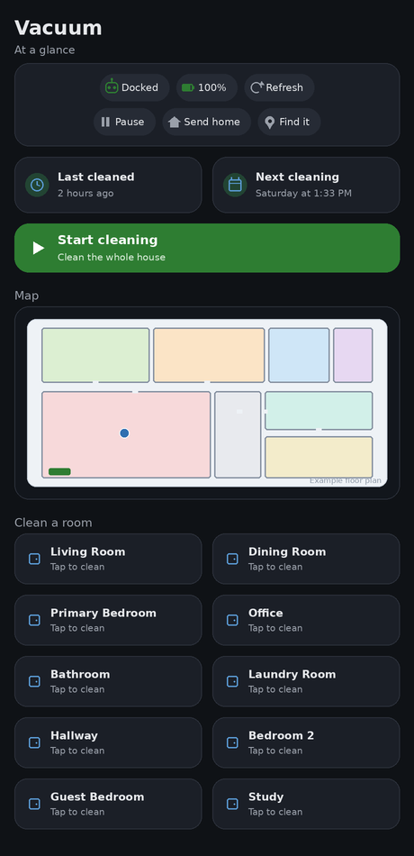

# Dreame Aqua10 → Home Assistant

A practical guide to integrating the **Dreame Aqua10 Roller** (`dreame.vacuum.r9533a`)
into Home Assistant, plus a dashboard generator that builds a live-map, per-room-cleaning
dashboard tailored to **your own** entities — no hardcoded entity IDs.

<p align="center">
  
</p>

> The image above is an illustrative mockup — generic floor plan and example room names,
> not a real home.

It covers two control paths that work well together:

- **Matter** — fully local, cloud-free control (start/stop/pause/dock, clean modes, room
  cleaning, live status and error reporting).
- **dreame_vacuum** (the [Tasshack integration](https://github.com/Tasshack/dreame-vacuum)) —
  cloud-based, but adds the live map, battery %, per-room map editing, and the full set of
  device settings.

> Tested against a Dreame Aqua10 on firmware `4.3.9_3655`, paired to a **Dreamehome** account,
> with Home Assistant `2026.6` and the Matter Server add-on.

---

## TL;DR

| Capability | Matter (local) | dreame_vacuum (cloud) |
|---|---|---|
| Start / Pause / Stop / Return to dock | ✅ | ✅ |
| Clean mode (Auto / Quick / Deep / Quiet / Mop…) | ✅ | ✅ + suction levels |
| Live status + detailed error reasons | ✅ | ✅ |
| Per-room / segment cleaning | ✅ (`vacuum.clean_area`) | ✅ (`vacuum_clean_segment`) |
| Battery % | ❌ | ✅ |
| Live map image | ❌ | ✅ |
| Mop wetness / water temperature / AI / schedules / maintenance | ❌ | ✅ |
| Works with the internet / cloud down | ✅ | ❌ |

**Recommended setup:** use **Matter** as the reliable, offline-proof control plane, and add
**dreame_vacuum** for the map and the deep settings. The two run side by side as independent
devices with no conflict.

---

## 1. Local control with Matter

Newer Dreame robots expose Matter. This gives genuine local control with no cloud account and
no token.

1. **Enable Matter in the Dreamehome app:** open the device → `…` (top-right) → the auxiliary
   functions page → **Matter**. It shows a QR code and an 11-digit pairing code.
2. **Commission into Home Assistant:** Settings → Devices & Services → **Add Integration** →
   **Matter** → *Add Matter device* → *No, it's new*. Scan the QR, or choose
   **Setup without QR-code** and type the 11-digit code.
   - Tip: QR scanning into third-party controllers is unreliable on some Dreame units —
     manual code entry is the dependable path.
3. Home Assistant creates a `vacuum.*` entity plus a clean-mode selector and
   operational-state / error sensors.

**Matter notes**

- Matter is multi-admin: Home Assistant can control the robot at the same time as the
  Dreamehome app (and Apple Home, Google Home, etc.).
- Some Dreame units occasionally drop from the Dreamehome app after Matter is added — a known
  firmware quirk, generally harmless.
- Battery %, the live map, and the advanced settings are **not** carried over Matter — that is
  what the cloud integration below adds.

### Room cleaning over Matter

Home Assistant's Matter vacuum support includes the `vacuum.clean_area` action (the Matter
Service Area feature). Map the robot's detected segments to Home Assistant areas in the vacuum
entity's settings, then trigger rooms from scripts/automations:

```yaml
service: vacuum.clean_area
target:
  entity_id: vacuum.aqua10_matter
data:
  cleaning_area_id: 1   # the area id reported by the device
```

---

## 2. Full features with the dreame_vacuum integration

The [Tasshack `dreame_vacuum`](https://github.com/Tasshack/dreame-vacuum) integration adds the
live map, battery, per-room controls, and every device setting.

### The "Account type 'dreame' is not supported" gotcha

If your robot is paired to a **Dreamehome** account (most 2024+ Dreame models are
Dreamehome-only), the **stable** release line of the integration will fail to load with:

```
Account type 'dreame' is not supported with this version of the integration!
```

This is by design — the stable line only supports Xiaomi / Mi Home accounts. **Dreamehome
support lives in the v2.0.0 beta.** Rolling back does not help.

### Fix / install

1. **HACS** → search **Dreame Vacuum** → install.
2. On the integration in HACS → `⋮` → **Redownload** → enable **Show beta versions** → pick the
   latest **`v2.0.0bXX`** → Download.
3. **Restart Home Assistant.**
4. Settings → Devices & Services → **Add Integration** → **Dreame Vacuum** → choose the
   **Dreamehome** account type → sign in (use your region's server; complete 2FA / captcha if
   prompted).

### Local vs. cloud reality check

The integration's *local* connection mode (host + token over MiIO/UDP 54321) only works for
devices registered to **Mi Home**. Once a device is on **Dreamehome**, its local API is
disabled, so the dreame_vacuum integration runs **cloud-routed** for Dreamehome devices. That
is why **Matter is the only fully-local option** for these robots. There is currently no
Valetudo / rooting path for the Aqua10.

---

## 3. Dashboard

A clean, mobile-friendly dashboard with a live map, per-room cleaning buttons, status,
last-cleaned / next-scheduled, and start/stop controls.

### Why a generator?

Every vacuum has a different entity name and a different set of rooms, so the dashboard
can't ship with hard-coded entity IDs. [`generate_dashboard.py`](generate_dashboard.py) reads
**your** entities from the Home Assistant API and writes a `vacuum.yaml` tailored to your
robot — nothing to hand-edit. It auto-discovers the vacuum, its map camera, battery, cleaning
history, and rooms, and only includes the cards your device actually supports.

> **Want to preview it first?** [`examples/vacuum.yaml`](examples/vacuum.yaml) is a ready-made
> sample built from example data — paste it to see the layout, then run the generator to build
> one bound to your own entities.

### Requirements

- HACS cards: [Mushroom](https://github.com/piitaya/lovelace-mushroom) and
  [card-mod](https://github.com/thomasloven/lovelace-card-mod).
- Python 3 to run the generator (PyYAML optional — used for prettier output if present).

### Quick start

1. Install the HACS cards above and hard-refresh your browser.
2. Create a Home Assistant **long-lived access token** (profile → Security → Long-lived access tokens).
3. Generate your dashboard:
   ```bash
   HA_URL=http://homeassistant.local:8123 HA_TOKEN=xxxxxxxx python3 generate_dashboard.py
   ```
   This writes `vacuum.yaml`, tailored to your entities.
4. Add a new dashboard → top-right ⋮ → **Edit Dashboard** → ⋮ → **Raw configuration editor** →
   paste the contents of `vacuum.yaml`.

### What you get

- **Status block** — status, battery, and quick **Pause / Send home / Find it**.
- **Last cleaned** and **Next cleaning** (the next run is computed from the vacuum's own schedule).
- A big **Start cleaning** button and a context-aware **Stop and return to dock**.
- The **live map**.
- A **per-room cleaning** button for each room — labels are read live, so rooms you rename in
  the app update on the dashboard without regenerating.

### Customize

Open `generate_dashboard.py` — adjust the room icons in `room_icon()` or the card colors in
the styles. Re-run it any time your rooms change to refresh the per-room buttons.

---

## Useful services (dreame_vacuum)

| Service | What it does |
|---|---|
| `dreame_vacuum.vacuum_clean_segment` | Clean specific rooms (`segments: [id, …]`) |
| `dreame_vacuum.vacuum_clean_zone` | Clean a drawn zone |
| `dreame_vacuum.vacuum_clean_spot` | Spot clean a point |
| `dreame_vacuum.vacuum_rename_segment` | Rename a room (`segment_id`, `segment_name`) |
| `dreame_vacuum.vacuum_set_cleaning_sequence` | Set room cleaning order |
| `dreame_vacuum.vacuum_request_map` | Refresh the map |

---

## Credits

- The cloud integration is [Tasshack/dreame-vacuum](https://github.com/Tasshack/dreame-vacuum).
- Dashboard built with [Mushroom](https://github.com/piitaya/lovelace-mushroom) and
  [card-mod](https://github.com/thomasloven/lovelace-card-mod).

## License

[MIT](LICENSE)
